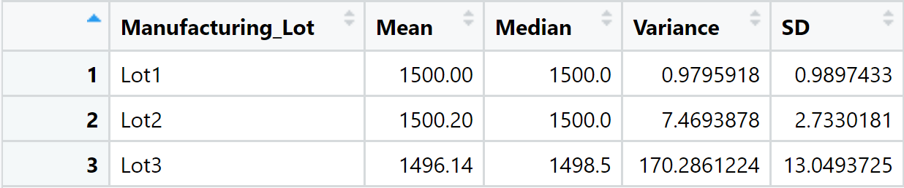
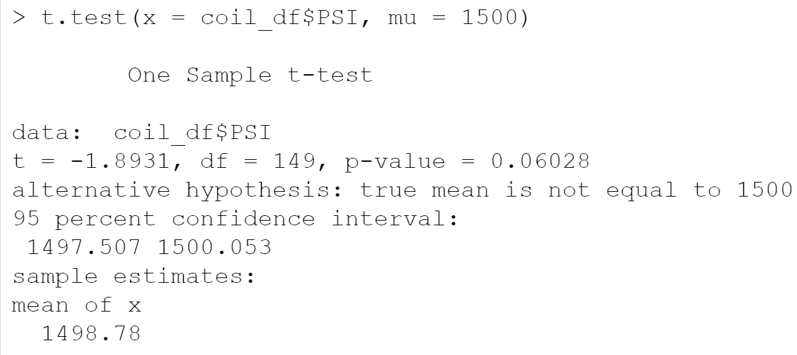
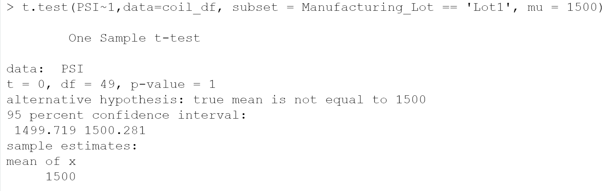
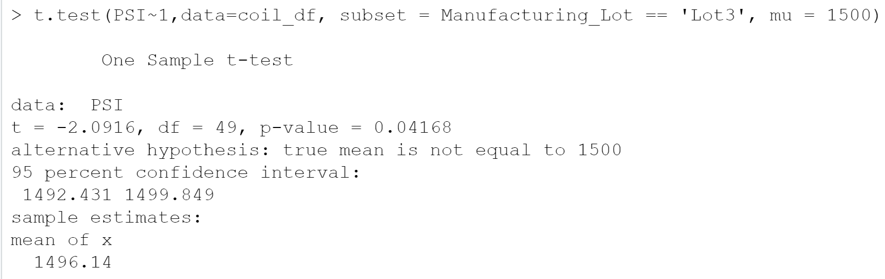

# MechaCar_Analysis

## Linear Regression to Predict MPG

Before running our multiple linear regression analysis we decided that a significance level of 0.05 the threshold to reject or accept our null hypothesis. And the hypotheses are as follows :
1. **H0**: The slope of the linear model is 0
2. **Ha**: The slope of the linear model is not 0

After fitting a linear model on the data we obtained the following results:  
  
Since the column labeled `Pr(>|t|)` denotes the probability that the corresponding coefficient contributes a random amount of variance to the model, we can conclude that the `(Intercept)`,`vehicle_length`, and `ground_clearence` variables all contribute a non-random amount of variance to the model. Additionally, we see that the p-value of the model is 5.35\*10-11 which is less than our pre-determined significance level, so we reject the null hypothesis and conclude that the slope of the linear model is not 0. Finally, the R2 value of the model is roughly 0.715. This means that our model explains about %71.5 of the variability in the dependent variable. While this would seem to suggest that our model does predict `mpg`, the high level of contribution of the `(Intercept)` along with the fact that not many of the other variables contribute significantly to the model may be evidence of overfitting. So while our model explains the data we have well, it is unlikely to generalize well to a larger dataset.

---
## Summary Statistics on Suspension Coils

In order to assess which lots may be contributing to the production hold up, summary statistics were prepared on the stress testing data of the MechaCar's suspension coils. We calculated summary statistics on the coils' PSI measurements overall and by lot. The results are displayed below:  
Summary Statistcs for all Lots:  

Summary Statistics by Lot:

The acceptable variance threshold for a suspension coil is 100 PSI. From the above data we see that the overall variance is high but still under the threshold. However, when we consider the lot-by-lot summary we see that lot 2 and 1 have a low variance and the high overall variance is being caused almost entirely by lot 3 which has a variance well above the threshold.

---
## T-Tests on Suspension Coils

The following one-sample t-tests all test the following hypotheses but for different samples of the dataset:
1. **H0**: There is no statistical difference between the sample and population mean
2. **Ha**: There is a statistical difference between the sample and population mean

The population mean for all the tests is 1500 PSI and the significance level we will use is 0.05.

### Sampling Every Lot's PSI Data

We fail to reject the null hypothesis since the p-value (0.06) is greather than 0.05. This makes sense since the sample mean is very close to the population mean

### Sampling Lot 1's PSI Data

We fail to reject the null hypothesis since the p-value (1) is greater than 0.05. This makes sense intuitively since the sample mean is exactly equal to the population mean

### Sampling Lot 2's PSI Data

We fail to reject the null hypothesis since the p-value (0.61) is greater than 0.05. This makes sense intuitively since the sample mean is only slightly greater than the population mean

### Sampling Lot 3's PSI Data

We reject the null hypothesis since the p-value (0.042) is less than 0.05. From our previous section this makes sense since Lot 3's PSI measurements have a high degree of variability and the mean of this sample is the lowest.

