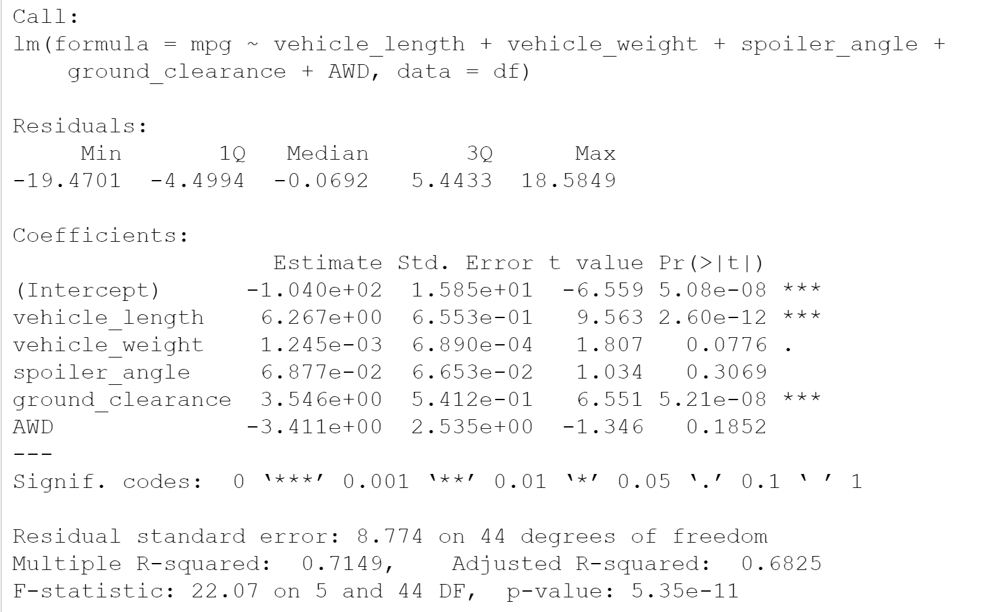

# MechaCar_Analysis

## Linear Regression to Predict MPG

Before running our multiple linear regression analysis we decided that a significance level of 0.05 the threshold to reject or accept our null hypothesis. And the hypotheses are as follows :
1. **H0**: The slope of the linear model is 0
2. **Ha**: The slope of the linear model is not 0

After fitting a linear model on the data we obtained the following results:  
  
Since the column labeled `Pr(>|t|)` denotes the probability that the corresponding coefficient contributes a random amount of variance to the model, we can conclude that the `(Intercept)`,`vehicle_length`, and `ground_clearence` variables all contribute a non-random amount of variance to the model. Additionally, we see that the p-value of the model is 5.35\*10-11 which is less than our pre-determined significance level, so we reject the null hypothesis and conclude that the slope of the linear model is not 0. Finally, the R2 value of the model is roughly 0.715. This means that our model explains about %71.5 of the variability in the dependent variable. While this would seem to suggest that our model does predict `mpg`, the high level of contribution of the `(Intercept)` along with the fact that not many of the other variables contribute significantly to the model may be evidence of overfitting. So while our model explains the data we have well, it is unlikely to generalize well to a larger dataset.
